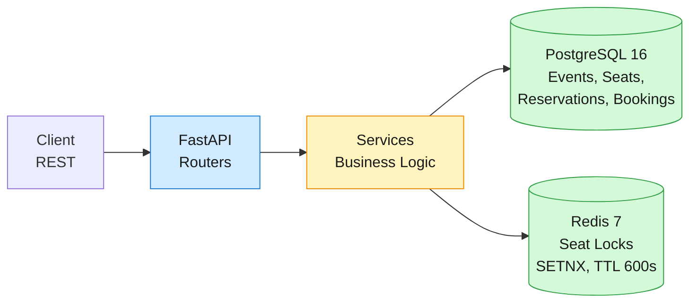
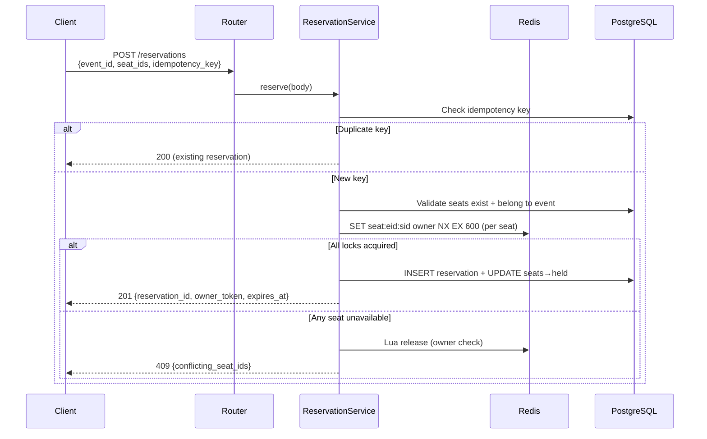
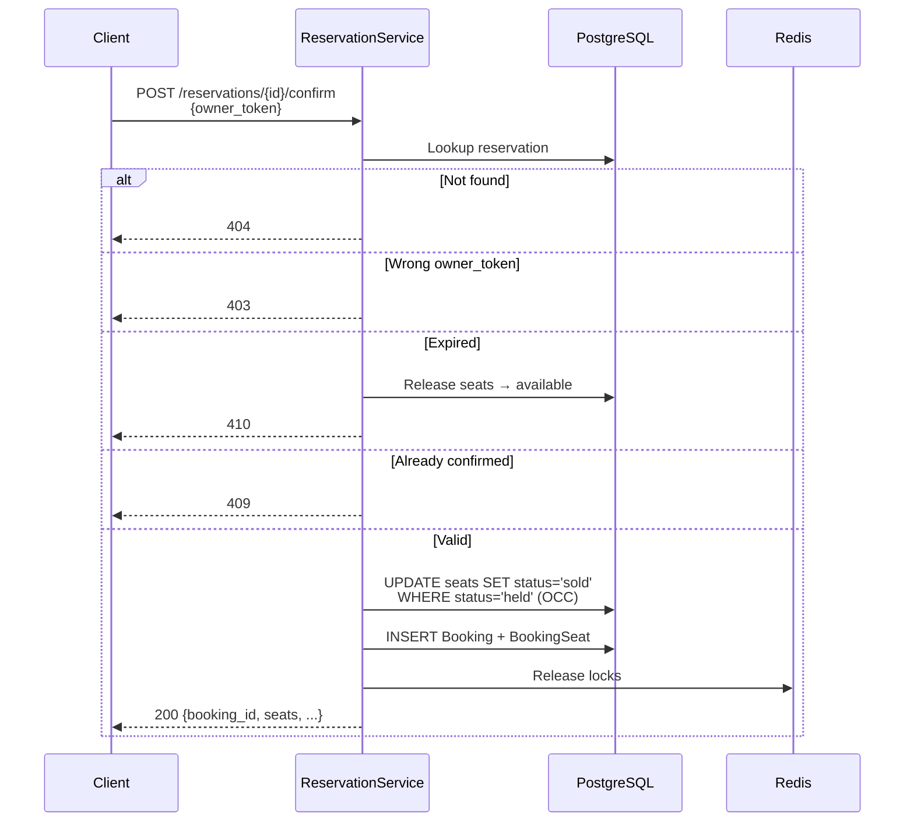

# Ticketmaster MVP — Design & Functional Spec

Event ticketing REST API: browse events, view seat maps, search, reserve seats, confirm bookings. Python 3.12, FastAPI, PostgreSQL 16, Redis 7.

## Architecture



Single-service REST API. No Kafka, no Elasticsearch, no Stripe (payment simulated), no waiting room. Seat reservation fast path uses Redis `SETNX` for sub-millisecond atomic lock acquisition with automatic TTL expiry. PostgreSQL is the durable source of truth. Search uses PostgreSQL `tsvector` with GIN indexes.

### Data flow — reserve seats (fast path)



### Data flow — confirm reservation



### Three-layer oversell prevention

| Layer | Mechanism | Property |
|-------|-----------|----------|
| 1 — Fast path | Redis `SET key value NX EX 600` | Sub-millisecond, atomic, auto-expiring |
| 2 — Durable path | PostgreSQL OCC: `UPDATE seats SET status='sold', version=version+1 WHERE seat_id=? AND version=? AND status='held'` | Catches TTL edge cases |
| 3 — Final backstop | `UNIQUE(seat_id)` on `booking_seats` | Database rejects duplicate seat assignment |

## Key Decisions

| # | Decision | Choice | Rationale |
|---|----------|--------|-----------|
| 1 | Seat lock | Redis SETNX + PostgreSQL OCC + UNIQUE INDEX | Three independent layers; each prevents oversell under different failure modes |
| 2 | Search engine | PostgreSQL `tsvector` + GIN index | MVP scope excludes Elasticsearch; GIN-backed tsvector gives acceptable keyword ranking |
| 3 | Payment | Simulated instant finalization | No real Stripe; avoids saga complexity while preserving reservation→confirm flow |
| 4 | Hold expiry | Redis TTL + lazy DB sweep on seat-map view | Redis auto-deletes; PostgreSQL catches edge cases on next seat-map read |
| 5 | Idempotency | Database `UNIQUE` on `idempotency_key` | Simplest correct implementation; no distributed state to reconcile |
| 6 | PK type | UUID v4 (`gen_random_uuid()`) | No coordination; safe for future horizontal scaling |
| 7 | ORM | SQLAlchemy 2.0 async | FastAPI ecosystem standard; async sessions; Alembic migrations |
| 8 | Owner token | Server-generated UUIDv4 | Eliminates trust boundary; simple and collision-free |
| 9 | HTTP framework | FastAPI | Native async, pydantic validation, auto-docs |
| 10 | Search cancellation filter | Exclude at query level (`WHERE status != 'cancelled'`) | Fewer rows transferred; avoids post-filter in Python |

## Scope

**In scope:**
- Browse events with category, date range filters
- View seat map with real-time availability status
- Search events by keyword, performer, venue
- Reserve seats atomically with 10-minute hold TTL
- Confirm reservation (simulated payment)
- Retrieve booking confirmation with seat assignments
- Redis-based seat-lock fencing with `owner_token` guard
- Exactly-once reservation via idempotency key

**Out of scope:**
- Interactive seat map rendering (SVG/Canvas) — API only
- Real Stripe payment integration
- Mobile ticket QR/barcode generation
- Virtual waiting room (Queue-it)
- Kafka event bus
- Elasticsearch full-text search
- Bot detection / anti-fraud
- Dynamic pricing
- Venue box-office POS integration

## Data Model

### PostgreSQL Tables

```sql
CREATE TABLE events (
    event_id   UUID PRIMARY KEY DEFAULT gen_random_uuid(),
    name       TEXT NOT NULL,
    performer  TEXT NOT NULL,
    venue      TEXT NOT NULL,
    category   TEXT NOT NULL,
    event_date TIMESTAMPTZ NOT NULL,
    status     TEXT NOT NULL DEFAULT 'scheduled'
               CHECK (status IN ('scheduled','cancelled','completed')),
    created_at TIMESTAMPTZ NOT NULL DEFAULT now()
);

CREATE TABLE seats (
    seat_id    UUID PRIMARY KEY DEFAULT gen_random_uuid(),
    event_id   UUID NOT NULL REFERENCES events(event_id),
    section    TEXT NOT NULL,
    row        TEXT NOT NULL,
    seat_label TEXT NOT NULL,
    price_tier TEXT NOT NULL,
    status     TEXT NOT NULL DEFAULT 'available'
               CHECK (status IN ('available','held','sold')),
    version    INTEGER NOT NULL DEFAULT 0,
    UNIQUE(event_id, seat_label)
);
CREATE INDEX idx_seats_event_status ON seats(event_id, status);

CREATE TABLE reservations (
    reservation_id  UUID PRIMARY KEY DEFAULT gen_random_uuid(),
    user_id         UUID NOT NULL,
    event_id        UUID NOT NULL REFERENCES events(event_id),
    seat_ids        UUID[] NOT NULL,
    owner_token     UUID NOT NULL,
    idempotency_key TEXT NOT NULL UNIQUE,
    expires_at      TIMESTAMPTZ NOT NULL,
    status          TEXT NOT NULL DEFAULT 'pending'
                    CHECK (status IN ('pending','confirmed','expired','cancelled')),
    created_at      TIMESTAMPTZ NOT NULL DEFAULT now()
);
CREATE INDEX idx_reservations_user ON reservations(user_id);

CREATE TABLE bookings (
    booking_id     UUID PRIMARY KEY DEFAULT gen_random_uuid(),
    reservation_id UUID NOT NULL UNIQUE REFERENCES reservations(reservation_id),
    user_id        UUID NOT NULL,
    total_cents    INTEGER NOT NULL DEFAULT 0,
    status         TEXT NOT NULL DEFAULT 'confirmed'
                   CHECK (status IN ('confirmed','cancelled')),
    created_at     TIMESTAMPTZ NOT NULL DEFAULT now()
);

CREATE TABLE booking_seats (
    booking_id UUID NOT NULL REFERENCES bookings(booking_id),
    seat_id    UUID NOT NULL,
    PRIMARY KEY (booking_id, seat_id),
    UNIQUE(seat_id)
);
```

Full-text search index (migration 002):

```sql
CREATE INDEX idx_events_search ON events
USING GIN (
    to_tsvector('english',
        coalesce(name, '') || ' '
        || coalesce(performer, '') || ' '
        || coalesce(venue, ''))
);
```

### Redis Keys

| Key | Value | TTL | Purpose |
|-----|-------|-----|---------|
| `seat:{event_id}:{seat_id}` | `owner_token` (UUID) | 600s | Atomic lock for seat hold |

Redis is used only for the seat-lock fast path. All other state is in PostgreSQL.

## API

Base URL: `http://localhost:8000` (env-overridable). All responses are JSON. Timestamps are ISO 8601. UUIDs are string-encoded.

### `GET /events` — Browse Events

Query params: `category` (optional), `date_from` (optional, ISO 8601), `date_to` (optional, ISO 8601), `lat`/`lon`/`radius` (accepted, ignored in MVP), `page` (default 1, page size 20).

Response `200`:
```json
{
  "events": [{
    "event_id": "<uuid>",
    "name": "Taylor Swift | The Eras Tour",
    "performer": "Taylor Swift",
    "venue": "MetLife Stadium",
    "category": "music",
    "event_date": "2026-07-04T20:00:00Z",
    "status": "scheduled",
    "available_seats": 15420
  }],
  "page": 1,
  "page_size": 20,
  "total": 150
}
```

Cancelled events excluded. `available_seats` is a live `COUNT(*) WHERE status='available'`. Empty page → `200` with `"events": []`, `"total": 0`. Invalid params → `422`.

### `GET /events/{event_id}/seats` — View Seat Map

Response `200`:
```json
{
  "event_id": "<uuid>",
  "seats": [{
    "seat_id": "<uuid>",
    "section": "A",
    "row": "1",
    "seat_label": "A1",
    "price_tier": "VIP",
    "status": "available"
  }]
}
```

Status values: `available`, `held`, `sold`. Real-time DB state; no caching. Expired holds released on each call. Valid event with no seats → `200` with `"seats": []`. Non-existent event → `404`.

### `GET /search` — Search Events

Query params: `q` (required, min 1 char). PostgreSQL full-text search via `plainto_tsquery('english', q)` against `tsvector` on name, performer, venue. Ranked by `ts_rank` descending.

Response `200`:
```json
{
  "results": [{
    "event_id": "<uuid>",
    "name": "Taylor Swift | The Eras Tour",
    "performer": "Taylor Swift",
    "venue": "MetLife Stadium",
    "category": "music",
    "event_date": "2026-07-04T20:00:00Z",
    "status": "scheduled"
  }]
}
```

Cancelled events excluded. Zero results → `200` with `"results": []`. Empty/missing `q` → `422`.

### `POST /reservations` — Reserve Seats

Request:
```json
{
  "event_id": "<uuid>",
  "seat_ids": ["<uuid>", "<uuid>"],
  "user_id": "<uuid>",
  "idempotency_key": "<string>"
}
```

Response `201` (new reservation):
```json
{
  "reservation_id": "<uuid>",
  "event_id": "<uuid>",
  "seat_ids": ["<uuid>", "<uuid>"],
  "user_id": "<uuid>",
  "owner_token": "<uuid>",
  "expires_at": "2026-07-04T12:10:00Z",
  "status": "pending"
}
```

Response `200` (idempotent retry): same shape as `201`, returning the original reservation.

All-or-nothing Redis lock acquisition per seat. `owner_token` is server-generated UUIDv4. All `seat_ids` must belong to `event_id`. Errors: `409` with `{"detail": "One or more seats are unavailable", "conflicting_seat_ids": [...]}`, `422` (empty seat_ids, missing fields, wrong event, different payload with same idempotency key).

### `POST /reservations/{reservation_id}/confirm` — Confirm Reservation

Request:
```json
{
  "owner_token": "<uuid>"
}
```

Response `200`:
```json
{
  "booking_id": "<uuid>",
  "reservation_id": "<uuid>",
  "user_id": "<uuid>",
  "total_cents": 0,
  "status": "confirmed",
  "seats": [{
    "seat_id": "<uuid>",
    "section": "A",
    "row": "1",
    "seat_label": "A1",
    "price_tier": "VIP"
  }],
  "created_at": "2026-07-04T12:05:00Z"
}
```

Fencing: `owner_token` must match reservation. OCC seat update (`WHERE status='held'`). Simulated payment (no real Stripe). Redis locks released on success. Errors: `404` (not found), `403` (wrong token), `410` (expired), `409` (already confirmed or seat conflict).

### `GET /bookings/{booking_id}` — Get Booking

Response `200`: same shape as confirm response (includes seats, created_at). Non-existent → `404`.

### `GET /healthz` — Health Check

Response `200`: `{"status": "ok"}`.

## Functional Requirements & Acceptance Tests

Each functional requirement maps to a black-box acceptance test in `verify/acceptance/` and a scenario class in `tests/functional/`.

| FR | Requirement | Acceptance Test | Functional Scenario |
|----|-------------|-----------------|---------------------|
| FR-1 | Browse events with filters, pagination | `test_fr1_browse_events.py` | `TestPagination` — page 1, high page, date ordering |
| FR-2 | View seat map with availability | `test_fr2_view_seat_map.py` | `TestValidationErrors` (404 path) |
| FR-3 | Full-text search events | `test_fr3_search_events.py` | `TestValidationErrors` (empty/missing `q`) |
| FR-4 | Reserve seats atomically | `test_fr4_reserve_seats.py` | `TestConflictDetection` — 409 on held seats |
| FR-5 | Confirm reservation (fencing, payment) | `test_fr5_confirm_reservation.py` | `TestOwnershipAuth` — 403 wrong token, double-confirm 409 |
| FR-6 | Get booking details | `test_fr6_get_booking.py` | `TestReservationLifecycle` — full flow |
| FR-7 | Release expired holds | `test_fr7_release_expired_holds.py` | — (TTL-dependent; acceptance-level only) |
| FR-8 | Idempotent reservation | `test_fr8_idempotent_reservation.py` | `TestIdempotency` — same key 200, different payload 422 |

### Functional Test Scenarios (6 scenarios in `tests/functional/test_endpoints.py`)

[](https://github.com/iliazlobin/sd-ticketmaster-backend-mvp/actions/workflows/functional.yml)
**CI workflow:** [`functional.yml`](https://github.com/iliazlobin/sd-ticketmaster-backend-mvp/actions/workflows/functional.yml) — spins up PostgreSQL 16, runs migrations, executes `pytest tests/functional/ -v`.

| Scenario | Class | What it verifies |
|----------|-------|-----------------|
| **1 — Pagination** | `TestPagination` | Page 1 returns first page with correct shape; high page returns `[]`; events ordered by date ascending |
| **2 — Validation errors** | `TestValidationErrors` | Invalid page param → 422; missing/empty search query → 422; empty seat_ids → 422; missing fields → 422; non-existent event seat map → 404; non-existent booking → 404 |
| **3 — Idempotency** | `TestIdempotency` | Same idempotency key returns `200` with same reservation; different seats with same key returns `422` |
| **4 — Ownership / fencing** | `TestOwnershipAuth` | Wrong `owner_token` on confirm → 403; double confirm → 409 |
| **5 — Reservation lifecycle** | `TestReservationLifecycle` | Full flow: reserve → seats show as `held` → confirm → booking retrieved → seats show as `sold` |
| **6 — Conflict detection** | `TestConflictDetection` | Reserving already-held seats → 409 with `conflicting_seat_ids` in response body |

## Unit Tests

[](https://github.com/iliazlobin/sd-ticketmaster-backend-mvp/actions/workflows/ci.yml)
**CI workflow:** [`ci.yml`](https://github.com/iliazlobin/sd-ticketmaster-backend-mvp/actions/workflows/ci.yml) — runs `pytest tests/unit/ -v` on every push, PR, and daily at 06:00 UTC.

| Module | File | Coverage |
|--------|------|----------|
| Config | `tests/unit/test_config.py` | Default settings, env overrides, TTL type |
| Event service | `tests/unit/test_event_service.py` | Browse (no filter, category, empty page, invalid date → 422, available seat count); seat map (404, ordered seats); search (ranked results, no results); expired hold release |
| Reservation service | `tests/unit/test_services.py` | Reserve (201 success, 200 idempotent retry, 422 different payload, 422 wrong event, 409 already held); confirm (404, 403 wrong token, 409 already confirmed); booking get (404) |

All unit tests run with mocked DB and Redis — no external dependencies required.

## Concurrency

- **Reserve:** Redis `SET NX` is atomic per key; pipelined for multi-seat. Partial failure triggers Lua release script that checks `owner_token` before `DELETE` to prevent releasing another user's lock.
- **Confirm (OCC):** `UPDATE seats SET status='sold', version=version+1 WHERE seat_id=? AND version=? AND status='held'`. If `rowcount=0`, another concurrent confirm won — return 409.
- **BookingSeat UNIQUE:** Final backstop. Even if OCC version checks somehow both pass, the UNIQUE(seat_id) rejects the duplicate INSERT.
- **Idempotency key:** `UNIQUE(idempotency_key)` on reservations. Second POST with same key returns 200 with original. Different seat_ids with same key → 422.
- **Expiry race:** If Redis TTL fires between reservation read and confirm seat update, the OCC check catches it (seat already released) → 410.
