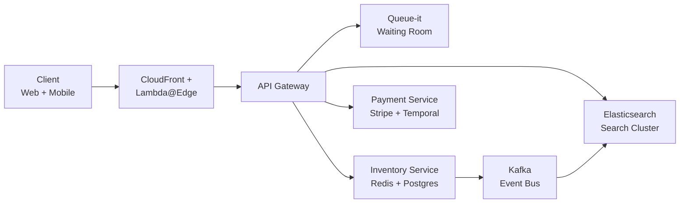
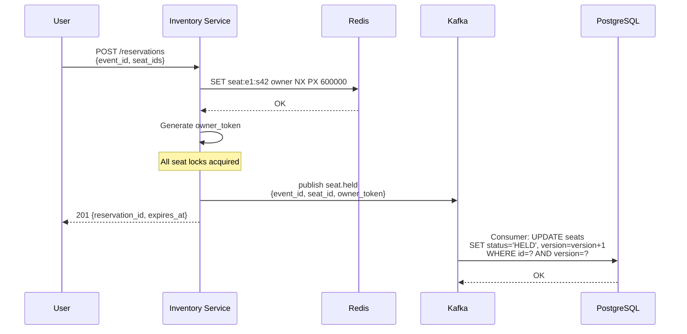

## 1. Problem frame
Ticketmaster sells 500 million tickets per year across 30+ countries, serving as the primary ticketing platform for Live Nation venues worldwide. The system enables fans to discover events, view interactive seat maps, reserve specific seats, pay, and receive authenticated mobile tickets. During a major onsale — Taylor Swift's Eras Tour drew 14 million concurrent users and 3.5 billion daily requests — the system must gate traffic through a virtual waiting room, meter admission to the booking service at 100K seat-lock TPS, and never sell the same seat twice. The adversary is real: 566 million bot attacks per day, driving \$1B+ in anti-bot investment over the past decade.

## 2. Requirements
**Functional**
- FR1: Browse events by date, location, category, price
- FR2: View an interactive seat map with real-time availability
- FR3: Search events by keyword, performer, venue
- FR4: Reserve seats for a limited time
- FR5: Complete purchase with secure payment
- FR6: Deliver mobile tickets
**Non-functional**
- NFR1: Inventory writes must be strongly consistent — the same seat must never be sold twice
- NFR2: Survive 14M concurrent users during hot onsales
- NFR3: Search results must reflect seat availability within 1-2 seconds
- NFR4: Exactly-once payment semantics across retries and failures
*Out of scope:* dynamic pricing algorithms, artist payout settlements, venue box-office point-of-sale integration, secondary market resale.
## 3. Back of the envelope
- **Seat-lock burst throughput:** 100K seat locks/sec at peak onsale → single Redis node (sub-ms SET NX EX) handles this; DynamoDB queue state engine handles 200K TPS for admission. Decision: Redis for fast-path locks, DynamoDB for queue state — separate stores optimized for their access patterns, not one store for everything.
- **Seat inventory storage:** 50K seats × 200 bytes × 100K events = \~1 TB. At peak onsale, read:write ratio shifts from 50:1 (browsing) to 2:1 (checkout), making the seat-map read path the dominant load outside onsale windows. Decision: never cache seat availability; serve seat-map GETs from Redis with 1-2s staleness refreshed via Kafka CDC.
- **Hold TTL:** Payment p99 latency (5-15s card auth + 3D Secure) + user hesitation + network retries = 10 minutes. Shorter → premature release during legitimate checkout. Longer (30 min) → blocked inventory from abandonment. Decision: 600-second Redis TTL matched to the p99 payment window with safety margin.
## 4. Entities & API
```javascript
Event
    event_id: UUID (PK)           ← shard key; all seats, holds, bookings co-located per event
    name: TEXT
    performer: TEXT
    venue_id: UUID (FK)
    onsale_time: TIMESTAMPTZ
    status: ENUM(draft, onsale, completed, cancelled)

Seat
    seat_id: UUID (PK)
    event_id: UUID (PK)           ← composite key with seat_id; event-based sharding
    section: VARCHAR(50)
    row: VARCHAR(10)
    seat_label: VARCHAR(10)
    price_tier_id: UUID (FK)
    status: ENUM(available, held, sold)  ← never cached; always read from primary path
    version: INTEGER              ← OCC fencing; must match on status transitions
    UNIQUE(event_id, seat_label)

Reservation
    reservation_id: UUID (PK)
    user_id: UUID
    event_id: UUID                ← shard key
    seat_ids: UUID[]
    owner_token: UUID             ← random fencing token; Redis lock value and release guard
    expires_at: TIMESTAMPTZ       ← NOW() + 10 minutes
    status: ENUM(pending, confirmed, expired, cancelled)

Booking
    booking_id: UUID (PK)
    reservation_id: UUID (FK)
    user_id: UUID
    payment_intent_id: VARCHAR(64)  ← Stripe PaymentIntent; idempotency key = SHA-256(booking_id, attempt)
    total_cents: BIGINT
    status: ENUM(pending, charged, fulfilled, refunded)
    UNIQUE(reservation_id)        ← one booking per reservation; prevents double-finalization

BookingSeat
    booking_id: UUID (PK)
    seat_id: UUID (PK)
    UNIQUE(seat_id)               ← final oversell guarantee; DB rejects duplicate seat assignment
```
**API**
- `GET /events?category=&date=&lat=&lon=&radius=&page=` — browse and discover events with geo-faceted filters
- `GET /events/:eventId/seats` — fetch seat map as section-partitioned vector tiles with real-time status
- `GET /search?q=&fq=&sort=` — full-text search across event name, performer, venue with BM25 ranking
- `POST /reservations` — reserve seats; body `{event_id, seat_ids, user_id}`; returns `{reservation_id, owner_token, expires_at}` or 409 if any seat unavailable
- `POST /reservations/:reservationId/confirm` — confirm reservation and initiate payment; body `{payment_token}`; returns `{booking_id, status}`
- `GET /bookings/:bookingId` — fetch booking and ticket delivery status
## 5. High-Level Design
```mermaid
graph TB
    subgraph clients[Clients]
        WEB[Web Browser]
        MOB[Mobile App]
    end

    subgraph edge[Edge]
        CF[CloudFront CDN]
        LE[Lambda@Edge<br/>Queue-it Connector]
    end

    subgraph services[Services]
        GW[API Gateway]
        SRCH[Search Service<br/>Elasticsearch]
        INV[Inventory Service<br/>Redis + Postgres]
        PAY[Payment Service<br/>Temporal Saga]
        TKT[Ticket Issuer<br/>SafeTix]
    end

    subgraph stores[Stores]
        ES[(Elasticsearch<br/>Search Index)]
        RD[(Redis<br/>Seat Locks + Cache)]
        PG[(PostgreSQL<br/>Seats + Bookings)]
        DDB[(DynamoDB<br/>Queue State)]
    end

    subgraph async[Async]
        KAF[Kafka<br/>Event Bus]
        CDC[CDC Stream<br/>Debezium]
    end

    WEB --> CF
    MOB --> CF
    CF --> LE
    LE -->|valid token| GW
    LE -.->|no token| DDB
    GW --> SRCH
    GW --> INV
    GW --> PAY
    SRCH --> ES
    INV --> RD
    INV --> PG
    PAY --> PG
    PAY --> TKT
    INV --> KAF
    KAF --> SRCH
    PG --> CDC
    CDC --> KAF
    PAY --> KAF

    classDef edge fill:#fff3bf,stroke:#f08c00,color:#1a1a1a;
    classDef svc  fill:#d0ebff,stroke:#1c7ed6,color:#1a1a1a;
    classDef store fill:#d3f9d8,stroke:#2f9e44,color:#1a1a1a;
    classDef async fill:#ffe8cc,stroke:#e8590c,color:#1a1a1a;

    class CF,LE edge
    class GW,SRCH,INV,PAY,TKT svc
    class ES,RD,PG,DDB store
    class KAF,CDC async
```
#### FR1: Browse and discover events
**Components:** Client → CloudFront CDN → API Gateway → Search Service → Elasticsearch index (fed by Kafka CDC from PostgreSQL).
**Flow:**
1. Client requests `GET /events?category=concerts&date=2026-07-04&lat=40.7&lon=-74.0&radius=50&page=1`
2. API Gateway routes to Search Service with pagination defaults (page size = 20)
3. Search Service queries Elasticsearch with `bool` query: `must` match on category + date range, `filter` on geo distance, `must_not` on status=cancelled
4. Search Service reads from Redis cache (5 min TTL on event metadata); cache miss → ES query → populate cache
5. Returns paginated event list with venue, date, price range, and availability indicator
**Design consideration:** Event metadata (name, performer, venue, date) is cacheable with aggressive TTLs (5 min Redis, 24h CDN for static venue data). Availability indicators are read from a separate lightweight count query against Redis seat-lock keys — `SCAN seat:{event_id}:* COUNT` — not from Elasticsearch, because stale ES indexes would show availability for sold-out events. The Search Service handles 17 languages via language-specific ES fields (`name_en`, `name_de`, `name_es`), avoiding analyzer one-size-fits-all degradation.
#### FR2: View interactive seat map
**Components:** Client → API Gateway → Inventory Service → Redis (seat status cache) → Kafka consumer refreshes.
**Flow:**
1. Client requests `GET /events/:eventId/seats`
2. API Gateway resolves `eventId` to the correct Inventory Service shard (by `event_id`)
3. Inventory Service reads section-partitioned vector tiles from Redis — one key per section: `seatmap:{event_id}:{section}` → compressed SVG/Canvas tile
4. Seat status colors applied server-side from Redis state: green (available), gray (held/sold), blue (user-selected in session)
5. Real-time updates pushed via SSE channel: Inventory Service subscribes to `seat.held` and `seat.released` Kafka topics, fans out to connected clients
**Design consideration:** A full arena seat map (70K seats × 200 bytes) is \~14 MB. Serving it as section-partitioned tiles (one per bowl/section, \~2-5 KB each) means the client only requests visible viewport tiles. Seat status is read from Redis with 1-2s staleness — refreshed by a Kafka consumer group that listens to `seat.held` and `seat.released` events from the Inventory Service. The critical rule: **never cache seat availability to CDN**. CDN-cached availability turns into overselling when the CDN edge node serves stale "available" status for a seat sold 30 seconds ago. Seat-map GETs always hit the service layer, not the CDN.
#### FR3: Search events
**Components:** Client → API Gateway → Search Service → Elasticsearch cluster (I3 instances) with BM25 ranking, geo filters, and custom plugins.
**Flow:**
1. Client requests `GET /search?q=taylor+swift&fq=date:[2026-07-01+TO+2026-07-31]&sort=relevance`
2. Search Service constructs ES query: `multi_match` on `name^4`, `performer^2`, `description`, `venue`, with `fuzziness: AUTO`
3. ES geo distance filter applied for location-aware queries; faceted aggregations compute date ranges, price buckets, category counts
4. Results filtered post-query: availability checked against Redis seat-lock key existence (seat count \> 0 for event)
5. Spellcheck: if zero results, ES `suggest` API returns Did-You-Mean candidates; service re-runs query with top suggestion
**Design consideration:** Ticketmaster migrated from Solr (2010) to Elasticsearch (2017) to support real-time seat availability in search results — 15 kiloseats indexed per second per host. The ES cluster uses I3 instances (double performance, 6× storage, half cost vs R3) with custom plugins for seat adjacency scoring and price-aware ranking. The CDC pipeline from PostgreSQL (Debezium → Kafka → ES indexing consumer) refreshes search within 1-2 seconds of seat state changes. "Miss-driven" spellcheck — retry with first suggestion when zero results found — guarantees a suggestion exists for every query, learned from 570 out of 2,000 failed searches producing 30% better results.
#### FR4: Reserve seats with hold
**Components:** Client → API Gateway → Inventory Service → Redis (SETNX lock) → Kafka (seat.held event) → PostgreSQL (async write).
**Flow:**
1. Client selects seats, calls `POST /reservations` with `{event_id, seat_ids, user_id}`
2. Inventory Service (sharded by `event_id`) generates `owner_token = UUIDv4()`
3. For each `seat_id`, executes Redis `SET seat:{event_id}:{seat_id} {owner_token} NX PX 600000` via pipelined commands
4. If all `SET NX` calls succeed → publish `seat.held` event to Kafka (event_id, seat_ids, owner_token) → return `{reservation_id, owner_token, expires_at}`
5. If any `SET NX` fails → run Lua script to release already-acquired locks (check owner_token match, then DEL) → return 409
6. Kafka consumer writes held state to PostgreSQL: `UPDATE seats SET status='HELD', version=version+1 WHERE seat_id=? AND status='AVAILABLE'`
**Design consideration:** The all-or-nothing multi-seat reservation uses pipelined Redis commands without MULTI/EXEC — each `SET NX` is independent because seat keys have no shared state. On partial failure, the Lua release script verifies owner_token before DELETE, preventing a race where TTL expiry grants the seat to User B, then User A's retry frees the wrong seat. The async PostgreSQL write via Kafka decouples the fast path (Redis, sub-ms) from the durable path (Postgres, \~5ms). Sharding by `event_id` colocates all seats for a hot event on a single Redis node, enabling single-shard multi-seat reservations and hot-event isolation.
#### FR5: Complete purchase with payment
**Components:** Client → API Gateway → Payment Service → Temporal Saga Orchestrator → Redis (seat status) + Stripe (payment) + PostgreSQL (booking finalization).
**Flow:**
1. Client calls `POST /reservations/:reservationId/confirm` with `{payment_token}` (Stripe.js tokenized card, never raw PAN)
2. Saga orchestrator (Temporal) starts workflow with reservation state loaded from previous step
3. Step 1 — Verify hold: check Redis lock still exists and `owner_token` matches; if expired, return 410 Gone
4. Step 2 — Charge: `Stripe.PaymentIntent.create(amount, currency, payment_method=token, idempotency_key=SHA256(booking_id, attempt_n))`
5. Step 3 — Finalize: `UPDATE seats SET status='SOLD', version=version+1 WHERE seat_id=? AND version=?` (OCC guard) → insert `BookingSeat` rows (UNIQUE INDEX on seat_id catches any race)
6. Step 4 — Issue: Ticket Issuer generates SafeTix rotating barcode → publish `booking_made` to Kafka → email/SMS/wallet push
7. On any step failure: compensate — release Redis locks (Lua ownership check), void Stripe charge if captured, update booking status=FAILED, notify user
**Design consideration:** 2PC is impossible because Stripe cannot participate as a resource manager — card authorization is fire-and-forget. The saga pattern with explicit compensating transactions replaces atomicity with eventual correctness: every forward step has a corresponding undo step. Temporal's durable execution means a worker crash mid-saga resumes from the last completed step with full event history. The idempotency key is server-generated at reservation time and persisted in Temporal state — network retries reuse the same key, and Stripe caches the key→response mapping for 24 hours, so a retry returns the cached result instead of charging twice. Card numbers never touch Ticketmaster servers; Stripe.js tokenizes on the client side, keeping PCI scope minimal.
#### FR6: Deliver authenticated mobile tickets
**Components:** Ticket Issuer → SafeTix engine → push notification (APNs/FCM) → mobile wallet integration.
**Flow:**
1. After payment confirmed and booking finalized, Ticket Issuer generates SafeTix ticket with rotating encrypted barcode
2. Barcode tied to fan account ID + ticket ID + timestamp; refreshes every \~15 seconds via HMAC-based rotation
3. Ticket pushed to Apple Wallet / Google Wallet via pass update API; also sent via email and SMS
4. Mobile app blocks screen recording during ticket display (platform DRM APIs)
5. At venue gate: scanner validates rotating barcode against current expected HMAC output
**Design consideration:** SafeTix encrypts the barcode payload with a key derived from the fan's account, so a screenshot is valid for at most 15 seconds before the rotation renders it stale. The rotation interval balances security (shorter = harder to screenshot-share) against offline gate scanning reliability (longer = more tolerant of brief connectivity loss). The barcode generation uses HMAC-SHA256 with a venue-specific secret key, validated at scan time by the gate scanner's offline cache of expected codes for the current time window.
## 6. Deep dives
### DD1: Ticket reservation and inventory — three-layer oversell prevention
**Problem.** The system must guarantee that a seat is never sold to two buyers, even under 100K seat-lock TPS with concurrent requests for the same seat arriving at different application instances. A single application-level lock is insufficient — bugs, race conditions, and operational failures require defense in depth. This directly addresses NFR1 (strong consistency for inventory writes) and NFR2 (surviving 14M concurrent users).
**Approach A — database row locks (SELECT FOR UPDATE).** The application begins a transaction, executes `SELECT * FROM seats WHERE seat_id = ? FOR UPDATE`, checks status, updates to HELD, and commits.
*Pro:* Single source of truth. No distributed state. Standard SQL, easy to reason about.
*Con:* At \>1K concurrent seat selectors, 9,999 transactions block in the DB lock waiter queue — the convoy effect exhausts the connection pool before any transaction completes. The system collapses faster than if it had no locking at all. This was Ticketmaster's pre-2000s architecture and failed under real onsale load.
**Approach B — application-level distributed lock with optimistic concurrency control.** A distributed mutex (Redis/ZooKeeper) guards seat access. The application acquires the lock, checks a version column, updates with `WHERE version = ?`, and releases.
*Pro:* Moves locking out of the database, reducing connection pressure. Version-based OCC detects stale writes.
*Con:* Still requires a database write on every lock attempt. Under 100K TPS contention, version conflicts force retry loops that cascade into exponential database load. The distributed lock becomes a choke point — Redis can handle the throughput, but the downstream DB writes to record each hold cause write amplification.
**Approach C — three-layer defense with Redis fast path, PostgreSQL OCC, and UNIQUE INDEX.** Layer 1: Redis `SET seat:{event_id}:{seat_id} {owner_token} NX PX 600000` — sub-millisecond, atomic, auto-expiring. Only the first caller succeeds. Layer 2: The eventual PostgreSQL write uses `UPDATE seats SET status='HELD', version=version+1 WHERE seat_id=? AND version=? AND status='AVAILABLE'` — catches TTL edge cases. Layer 3: `CREATE UNIQUE INDEX ON booking_seats(seat_id)` — the database rejects a duplicate row even if application code has bugs in Layers 1-2.
*Pro:* The fast path (Redis) handles 100K TPS on a single node. The durable path (PostgreSQL) runs asynchronously via Kafka, decoupled from the user-facing response. The UNIQUE INDEX is the final correctness guarantee — it costs nothing in the success path and catches rare races that slip past Redis and OCC.
*Con:* Added infrastructure (Redis + Kafka + CDC pipeline). Must manage TTLs correctly — too short and holds expire during checkout; too long and abandoned carts block inventory. The owner_token Lua release adds complexity to the release path.
**Decision.** Approach C — Redis SETNX + PostgreSQL OCC + UNIQUE INDEX.
**Rationale.** Ticketmaster's Eras Tour postmortem confirmed inventory service held up under 3.5B daily requests — it was the code-validation service that buckled, not the seat-lock mechanism. The three-layer pattern is documented across the AWS Well-Architected Framework for ticketing workloads and employed by SeatGeek's virtual waiting room architecture on DynamoDB + Lambda. The UNIQUE INDEX pattern in particular is the belt-and-suspenders answer at FAANG interview depth — relying on application-level locking alone is a known failure pattern.
**Edge cases.** *TTL expiry during payment:* If a hold's 600s TTL expires while the user is on the Stripe checkout page, the Lua ownership check on `confirm` fails, the saga compensates, and the user must re-select seats. *Crash between Redis SETNX and Kafka publish:* The seat is locked in Redis but no event is emitted. The seat map SSE channel won't update, but the lock prevents double-booking — the Kafka consumer catches up via full reconciliation on restart. *Multi-seat partial failure:* If 3 of 4 seats succeed at SETNX, the Lua release undoes the 3 successful locks, and the user retries — all-or-nothing semantics prevent partial holds. *Redis node failure during onsale:* The PostgreSQL OCC layer catches writes from the Redis-less window; seat availability briefly drops to eventual consistency but no overselling occurs.

💡 **Hold TTL is a business constraint, not a technical one.** The 10-minute window derives from payment processor latency (Stripe auth = 5-15s, 3D Secure challenges add 30-60s), user cart behavior (average checkout time is 2-3 minutes for known events), and the tradeoff between conversion rate (longer TTL = more completed checkouts) and inventory utilization (shorter TTL = more seats recycled to waiting users). Ticketmaster's verified fan pre-registration reduces the abandonment rate by pre-qualifying intent, making the 10-minute window efficient for most onsales.
### DD2: Onsale queue and traffic management — surviving 14M concurrent users
**Problem.** During hot onsales, 14M concurrent users hit the booking service simultaneously. Without admission control, the inventory service collapses under a thundering herd within \~30 seconds. The queue must absorb arbitrary spikes and meter admission at a rate the backend can sustain — this directly addresses NFR2 (14M concurrent survival).
**Approach A — simple FIFO waiting room with Redis sorted set.** Users are assigned a rank by arrival time in a Redis sorted set. Top N users are admitted per batch. SSE pushes queue position.
*Pro:* Simple implementation. Redis sorted set ZADD/ZPOPMIN operations are O(log N) and handle the throughput. Queue position is transparent to users.
*Con:* Pure FIFO rewards bots that optimize for arrival-time microsecond advantages. Real fans lose to scripts. No prioritization for Verified Fan pre-registrants who proved identity over a 1-2 week window. This was the naive approach that failed against sophisticated scalping operations.
**Approach B — priority queue with Verified Fan scoring.** Users pre-register 1-2 weeks before onsale. ML models score each registrant on purchase history, account age, phone verification, device fingerprinting, and social graph signals. During onsale, the queue sorts by a combined score — Verified Fan status is weighted highest, then fan engagement score, then random shuffle within score bands. Still uses Redis sorted set, with score replacing timestamp as the sort key.
*Pro:* Shifts the battle from "microsecond zero" (who clicks fastest at onsale time) to "registration window" (who proved they're a real fan over weeks). Bots cannot win by optimizing arrival time because the queue is not purely FIFO. Ticketmaster's Smart Queue uses exactly this priority model.
*Con:* Requires a pre-registration infrastructure separate from the onsale system. Score computation must be offline to avoid per-user ML inference in the hot path. "Random shuffle within score bands" still has a luck component that frustrates some real fans.
**Approach C — Queue-it DynamoDB edge architecture with JWT admission tokens.** A dedicated queue engine (Queue-it, deployed at 100B+ visitors processed) runs on DynamoDB at the CloudFront edge. Lambda@Edge intercepts every request, checks for a valid `queueittoken` JWT, and either redirects to the waiting room or forwards to Ticketmaster's API Gateway. The waiting room issues HMAC-SHA256-signed admission tokens when a user is dequeued. The token is validated at the API Gateway — no token, no access to booking services.
*Pro:* Traffic intercepted at the edge before it reaches origin servers. DynamoDB handles 100-200K TPS per table, with on-demand scaling to absorb spikes. The admission token is cryptographically signed — users cannot forge tokens or replay expired ones. Queue state lives in DynamoDB, not application memory, so crashes recover with no state loss. Batch dequeue at 5K/sec leaks users into the checkout flow at exactly the rate the booking service can sustain.
*Con:* Adds a third-party dependency (Queue-it) at the critical path. Token validation adds latency (\~10ms per request at Lambda@Edge). The HMAC secret must be rotated and distributed to all edge locations — operational complexity.
**Decision.** Approach C — Queue-it DynamoDB edge architecture for the production system; Approach B (Redis sorted set priority queue) for interview-appropriate depth.
**Rationale.** Queue-it is the production system powering Ticketmaster, processing 13B+ bots blocked across 1,000+ events. DynamoDB was chosen over Redis for queue state because, as Queue-it's Distinguished Product Architect Mojtaba Sarooghi explained on SE Radio 700: "DynamoDB can be seen as persistent storage that is pretty fast... when you have a cache you need to be careful about the cache being stale — we can trust DynamoDB for this scenario." The edge deployment model (Lambda@Edge + CloudFront) isolates queue traffic from origin servers entirely. The 2022 Eras Tour meltdown confirmed the priority: 3.5M pre-registered, 1.5M Verified Fan codes sent, 14M concurrent users arrived — 4× the design target. The code-validation service buckled under bot-targeted traffic, not the queue or inventory service.
**Edge cases.** *Queue position spoofing:* Users cannot forge tokens because the HMAC-SHA256 signature is validated at every edge. *Admitted user's browser crashes:* The admission token includes a TTL (15 minutes); if the user reconnects within the window, the existing token works. After expiry, they re-enter the queue at the back. *Batch dequeue rate mismatch:* If dequeue at 5K/sec exceeds booking service capacity (e.g., due to degraded Redis), the admission rate is dynamically throttled based on backend health metrics pushed to the queue engine. *CDN edge location failure:* CloudFront automatically routes to the next nearest edge; the queue state is in DynamoDB (regional), not edge-local, so queue position is preserved.
💡 **The real threat during onsales is bot traffic, not human traffic.** Ticketmaster blocks 566 million bots per day — 25 million fake sign-up attempts daily with a 99.7% rejection rate. The queue architecture must treat adversarial load as the dominant design constraint. Pre-registration + Verified Fan scoring + device fingerprinting + rate limiting at the CDN edge have reduced bot success rates, but the arms race continues. The Eras Tour's code-validation service failure was caused by bots targeting passcode validation "for the first time" at 3× the prior peak — the queue successfully held, but the adjacent anti-bot service was the weak link.
### DD3: Search at scale — real-time availability in full-text results
**Problem.** Search must combine traditional full-text retrieval (17 languages, BM25 ranking, geo filters, faceted navigation) with real-time seat availability — a volatile signal that changes every second as seats are held and released. A stale search index shows "available" for sold-out events. This addresses NFR3 (1-2 second freshness for seat availability in search).
**Approach A — search index refreshed on a cron schedule.** Rebuild the search index nightly from PostgreSQL. Availability indicators are a stale approximation.
*Pro:* Simplest architecture. Search queries are fast because the index is static between rebuilds.
*Con:* During an onsale, 100K seats change state per second. A 1-hour-old index shows completely wrong availability. This was Ticketmaster's pre-2010 home-grown search and "officially sucked" — users clicked "Buy" on events shown as available that had sold out hours earlier.
**Approach B — PostgreSQL full-text search with GIN indexes.** Use PostgreSQL's `tsvector` with GIN indexes for full-text, and JOIN against the live `seats` table for availability.
*Pro:* Single source of truth — availability is always current because it queries the live database. No separate search infrastructure to maintain.
*Con:* PostgreSQL full-text search lacks the ranking sophistication, faceting performance, and language-specific analyzer support of a dedicated search engine. Joining full-text results with seat availability tables creates query plans that degrade under concurrent load — a search during a hot onsale competes with inventory writes for database resources.
**Approach C — Elasticsearch with real-time CDC availability feed.** Elasticsearch indexes event metadata + seat availability from a Kafka CDC stream. Debezium captures PostgreSQL changes → Kafka → ES indexing consumer updates the search index with seat count deltas within 1-2 seconds. Search queries hit Elasticsearch directly; availability is embedded in the index, not joined at query time.
*Pro:* BM25 ranking with field boosting (name\^4, performer\^2), faceted aggregations, geo distance filters, and 17-language analyzer support — all in one query. Availability freshness is 1-2 seconds because the CDC pipeline streams every `seat.held` and `seat.released` event. I3 instances deliver 15 kiloseats indexed per second per host at half the cost of previous R3 hardware.
*Con:* Elasticsearch is not strongly consistent — the index may lag the PostgreSQL source of truth by 1-2 seconds. During that window, a search result might show a seat as available that was just sold. This is acceptable for discovery (users click through to the seat map, which queries live Redis state), but must never be used for the final booking decision.
**Decision.** Approach C — Elasticsearch with CDC availability feed. PostgreSQL full-text search for moderate scale; Elasticsearch for Ticketmaster's 30-country, 17-language, real-time scale.
**Rationale.** Ticketmaster's 2017 Elasticsearch migration was presented at Elastic\{ON\} by CDO John Carnahan. Key findings: pushing data through a stream (Kafka) first is the architectural invariant — "flexibility on where data lands, as long as it goes through a stream first." Compression settings were critical — "not obvious that compression would help at first but made a huge difference because data between nodes was large." Custom Elasticsearch plugins for seat adjacency scoring and price-aware ranking produced results that generic search could not. The critical design rule: **Elasticsearch is for search, not for serving seat data to browsers quickly en masse** — the seat map and booking services use Redis, not Elasticsearch, for the operational data path.
**Edge cases.** *CDC lag during onsale burst:* If Kafka consumer lag exceeds 5 seconds, search results may show stale availability. The API Gateway adds a response header `X-Availability-Freshness: stale` when lag exceeds a threshold, and the UI displays a warning banner. *Elasticsearch cluster degradation:* Circuit breakers at the Search Service return cached event metadata (Redis, 5 min TTL) without availability indicators when ES is unhealthy. *Index corruption:* The full reindex from PostgreSQL runs nightly — recovery is a complete reindex from the source of truth, not a log replay. *Language-specific queries:* "P!NK" must match "Pink" in English and German indexes — synonym rules handle artist-name variations across languages.
### DD4: Payment and idempotency — exactly-once charge semantics
**Problem.** Charging a card twice is worse than selling a seat twice — refunds cost \$15-25 per transaction in interchange fees, damage reputation, and trigger regulatory scrutiny. But network retries, timeouts, and crash recovery make exactly-once delivery impossible at the transport layer. The system must guarantee at-most-once charging through application-level idempotency. This directly addresses NFR4 (exactly-once payment semantics).
**Approach A — single long transaction spanning database and payment processor.** `BEGIN; reserve seats; charge card; UPDATE seats; COMMIT;`
*Pro:* Appears atomic — if any step fails, roll back everything.
*Con:* 2PC is impossible because Stripe cannot participate as a resource manager. You cannot `PREPARE` a card authorization — it's fire-and-forget. If the `charge card` call succeeds but the `COMMIT` fails, the user is charged but has no ticket. If `charge card` times out, you don't know whether the charge was processed. This approach produces exactly the double-charge and lost-ticket outcomes it claims to prevent.
**Approach B — two-phase booking (reserve then confirm) with client retries.** Phase 1: `POST /reservations` reserves seats and returns a `reservation_id`. Phase 2: `POST /reservations/:id/confirm` charges the card and finalizes. Client retries on timeout.
*Pro:* Separates reservation from payment — the fast path (Redis lock) completes before payment begins. If confirm fails, the hold is still active and the user can retry.
*Con:* If the confirm request times out (Stripe processed the charge, but the response was lost in transit), the client retries and charges the card a second time. Without idempotency, at-least-once delivery at HTTP means at-least-once charging. A crash between Stripe charge success and database write leaves the seat in HELD state and the user charged — no ticket, no automatic recovery.
**Approach C — saga orchestration with server-generated idempotency keys.** A Temporal saga orchestrator executes a 4-step workflow: verify hold → charge with idempotency key → finalize seats → issue ticket. The idempotency key is `SHA-256(booking_id || attempt_number)`, generated at reservation time and persisted in Temporal's workflow state. Every external call (Stripe charge, DB update) uses the same key on retry. Stripe caches the key→response mapping for 24 hours — a retry with the same key returns the cached result. On any step failure, compensation runs: release Redis locks (Lua ownership check), void Stripe charge, update booking status.
*Pro:* Exactly-once charging through idempotency, not transport guarantees. Crash recovery is built into Temporal — if the worker dies mid-saga, the next worker replays the workflow from the last completed step, reusing the same idempotency key. Compensation is automatic and exhaustive — every forward step has a corresponding undo. PCI scope is minimal because card numbers never touch Ticketmaster servers (Stripe.js tokenization).
*Con:* Temporal adds operational complexity — a separate cluster with its own Cassandra/PostgreSQL backing store. Saga workflows are eventually consistent, not immediately consistent — there's a window where the seat is still HELD but the charge is processing. The idempotency key format must be carefully namespaced to avoid collisions across bookings.
**Decision.** Approach C — saga orchestration with server-generated Stripe idempotency keys.
**Rationale.** Stripe's idempotency key contract (documented at [stripe.com/blog/idempotency](http://stripe.com/blog/idempotency)) is the industry standard: keys are cached for 24 hours, and the response includes the original HTTP status code and body. This means a timeout on the charge call can be safely retried — if Stripe already processed it, the cached response is returned; if not, it processes the charge exactly once. Uber's Cadence (later Temporal) was built for exactly this use case: long-running business transactions across unreliable service boundaries. The 2022 Eras Tour processed 2M ticket sales in one day without reported double-charge incidents, validating the idempotency-key approach at scale.
**Edge cases.** *Stripe idempotency key collision:* Two different bookings generating the same key (astronomically unlikely with SHA-256, but the keys are namespaced by booking_id to eliminate even theoretical risk). *Stripe 24-hour cache expiry:* A retry after 24 hours with the same key is treated as a new charge. The saga enforces a maximum retry window of 1 hour with exponential backoff, well within Stripe's 24-hour cache window. *Saga timeout during 3D Secure:* The 10-minute hold TTL is designed to cover the full 3D Secure challenge window. If the challenge exceeds 10 minutes, the hold expires, the saga compensates, and the user must re-enter the queue. *Payment processor outage:* Sagas are paused (not failed) during downstream unavailability. Temporal retries with exponential backoff (1s → 2s → 4s → 8s → ... → 60s max) for up to the hold TTL, then compensates.
💡 **Idempotency keys are server-generated, never client-generated.** Client-generated keys (e.g., a UUID from the browser) introduce a trust boundary — a malicious or buggy client can replay a key for a past successful charge. Server-generated keys bound to the booking state eliminate this vector. The key derivation formula `SHA-256(booking_id || attempt_number)` means: the first attempt is attempt_0, a network retry reuses attempt_0, and a genuine re-charge (user explicitly retries after a declined card) gets attempt_1 — a different key and a new Stripe PaymentIntent.
## 7. Trade-offs
<table header-row="true">
<tr>
<td>Decision</td>
<td>Chosen</td>
<td>Rejected</td>
<td>Why</td>
</tr>
<tr>
<td>Seat lock mechanism</td>
<td>Redis SETNX + PostgreSQL OCC + UNIQUE INDEX</td>
<td>SELECT FOR UPDATE, pure application mutex</td>
<td>Convoy effect collapses DB under \>1K concurrent; 3-layer defense survives 100K TPS with each layer independently preventing oversell</td>
</tr>
<tr>
<td>Queue engine store</td>
<td>DynamoDB (Queue-it) for queue state; Redis for seat locks</td>
<td>Single store (Redis or DynamoDB for everything)</td>
<td>DynamoDB: persistent, no stale-cache risk for queue position. Redis: sub-ms for seat-lock fast path. Each store optimized for its access pattern</td>
</tr>
<tr>
<td>Search engine</td>
<td>Elasticsearch with CDC availability feed</td>
<td>Solr (previous), PostgreSQL GIN (smaller scale)</td>
<td>15K seats/sec indexing, BM25 ranking, 17-language analyzers, custom plugins for seat adjacency. PostgreSQL GIN degrades under concurrent search+write</td>
</tr>
<tr>
<td>Payment coordination</td>
<td>Temporal saga with idempotency keys</td>
<td>2PC, simple two-phase with client retries</td>
<td>Stripe can't 2PC. Client retries without idempotency = double-charge. Saga + idempotency key = exactly-once charging with automatic compensation</td>
</tr>
<tr>
<td>Admission control</td>
<td>Priority queue (Verified Fan scoring) at edge (Lambda@Edge)</td>
<td>Pure FIFO queue</td>
<td>FIFO rewards bots optimizing arrival time. Priority queue shifts competition to a 1-2 week registration window where bots are detected via ML scoring</td>
</tr>
<tr>
<td>Seat map delivery</td>
<td>SSE from Redis via Kafka consumer</td>
<td>WebSocket, polling</td>
<td>SSE is unidirectional (server→client), cheaper per connection than WebSocket for seat status updates. Polling burns resources on 90% no-change responses</td>
</tr>
<tr>
<td>Cache policy for seat availability</td>
<td>Never cache to CDN; Redis with 1-2s staleness for seat-map tiles</td>
<td>Cache seat availability to CDN</td>
<td>Stale CDN-cached availability = overselling. Seat status is the one data that must always come from the service layer</td>
</tr>
</table>
## 8. References
**Primary sources**
1. [Ticketmaster — Taylor Swift Eras Tour Onsale Explained](https://business.ticketmaster.com/press-release/taylor-swift-the-eras-tour-onsale-explained/)
2. [Live Nation — Bot Arms Race & TICKET Act](https://newsroom.livenation.com/news/live-nation-ticketmaster-stand-with-artists-calling-for-meaningful-ticketing-reform/)
3. [Ticketmaster — SafeTix Security & \$1B Anti-Bot Investment](https://newsroom.livenation.com/news/ticketmaster_advances_ticket_security_efforts_with_new_mobile_ticket_design_and_enhanced_protections/)
4. [AWS Blog — Ticketmaster Serverless Data Stream (1M req/s)](https://aws.amazon.com/blogs/media/ticketmaster-optimizes-add-on-purchases-for-fans-with-a-unified-serverless-data-stream-powered-by-aws/)
5. [AWS Executive Insights — Live Nation Cloud Migration (58% cost reduction)](https://aws.amazon.com/executive-insights/enterprise-strategists/jake-burns/)
6. [Elastic\{ON\} 2017 — Revolutionizing Fan Experience with Search at Ticketmaster](https://speakerdeck.com/elastic/revolutionizing-the-fan-experience-with-search-at-ticketmaster)
7. [ApacheCon NA 2010 — Implementing Solr at Ticketmaster](http://www.modperlcookbook.org/~geoff/slides/ApacheCon/2010/solr-at-ticketmaster-printable.pdf)
8. [Queue-it — Virtual Waiting Room Architecture](https://queue-it.com/smooth-scaling-podcast/ep017-virtual-waiting-room-architecture/)
9. [SE Radio 700 — Mojtaba Sarooghi on Waiting Rooms for High-Traffic Events](https://se-radio.net/2025/12/se-radio-700-mojtaba-sarooghi-on-waiting-rooms-for-high-traffic-events/)
10. [Stripe — Idempotency Key Design](https://stripe.com/blog/idempotency)
11. [Temporal — Saga Pattern Made Easy](https://temporal.io/blog/saga-pattern-made-easy)
12. [Ticketmaster — 100M Transactions/Day Traced with Jaeger](https://medium.com/jaegertracing/ticketmaster-traces-100-million-transactions-per-day-with-jaeger-38ec6cf599f0)
13. [TechTarget — Ticketmaster Unifies DevOps with Confluent Kafka](https://www.techtarget.com/searchitoperations/news/252472217/Ticketmaster-unifies-DevOps-monitoring-with-Confluent-Kafka)
**Comparison sources:** [SpaceComplexity Ticketmaster](https://spacecomplexity.ai/blog/ticketmaster-system-design-interview), [HLD Handbook — Design a Ticketing System](https://hld.handbook.academy/curriculum/case-studies/ticketing-system/), [HelloInterview Ticketmaster](https://www.hellointerview.com/learn/system-design/problem-breakdowns/ticketmaster), [CalibreOS HLD Ticketing](https://www.calibreos.com/learn/hld-ticketing-system), [Vetora Labs Ticketing](https://vetoralabs.com)